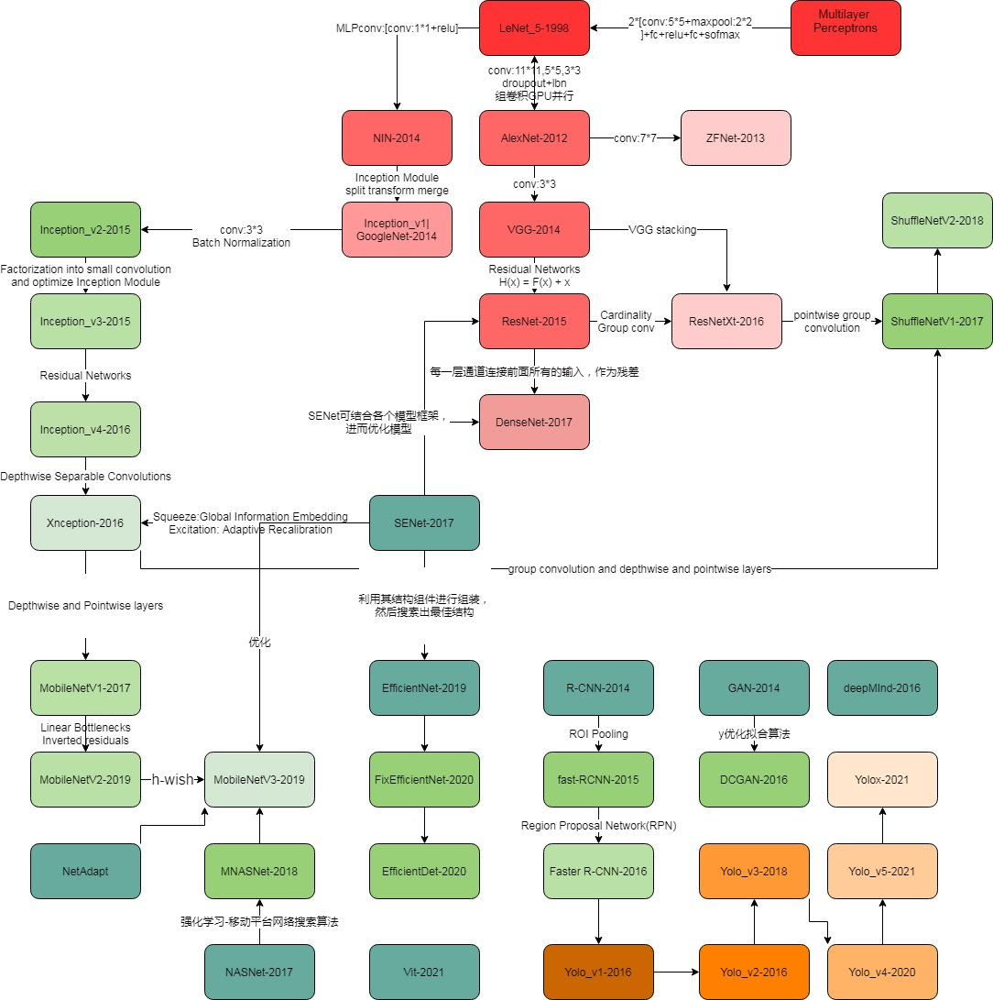

# :snail:nlp_cv_recommendation_papers:honeybee:

######  :sparkles:蜗牛会飞？:sparkles:

1. 记录NLP、CV、Recommend领域到现在发展产生的papers.
2. 励志根据时间线与发展流程图去介绍原理和代码实践两个方面.
3. 分析理解三个领域的发展和之间的技术联系与应用.

###### :imp: 原理介绍

 现阶段papers已基本整理完成，后续会不断添加papers阅读说明

######  :imp: 代码实践

代码实践正在进行中，有些代码正在整理。

---

####  :whale2: papers模拟三领域发展情况

 您可从流程图找到模型之间的联系，并可从paper中了解原理。

对于各个模型之间的联系如有疑问或错误，欢迎共同探讨！！！

######  :ram:推荐领域

######          **传统领域**  

###### :dolphin:深度学习领域

###### :dolphin:CV领域

​	

###### :dolphin:NLP领域

----

### cv_papers

 **CNN**

* [[CNN History] Backpropagation Applied to Handwritten Zip Code Recognition](https://github.com/snailfrying/nlp_cv_recommendation_papers/blob/main/cv_papers/CNN/%5BCNN%20History%5D%20Backpropagation%20Applied%20to%20Handwritten%20Zip%20Code%20Recognition.pdf)  
* [[CNN Image] ImageNet Classification with Deep Convolutional](https://github.com/snailfrying/nlp_cv_recommendation_papers/blob/main/cv_papers/CNN/%5BCNN%20Image%5D%20ImageNet%20Classification%20with%20Deep%20Convolutional.pdf)  
* [[CNN] Notes on Convolutional Neural Networks](https://github.com/snailfrying/nlp_cv_recommendation_papers/blob/main/cv_papers/CNN/%5BCNN%5D%20Notes%20on%20Convolutional%20Neural%20Networks.pdf)  
* [[CNN_Neocognitron ] A Self organizing Neural Network Model for a Mechanism of Pattern Recognition Unaffected by Shift in Position ](https://github.com/snailfrying/nlp_cv_recommendation_papers/blob/main/cv_papers/CNN/%5BCNN_Neocognitron%20%5D%20A%20Self%20organizing%20Neural%20Network%20Model%20for%20a%20Mechanism%20of%20Pattern%20Recognition%20Unaffected%20by%20Shift%20in%20Position%20.pdf)  

  **AlexNet**

  * [[AlexNet] ImageNet Classification with Deep Convolutional Neural Networks](https://github.com/snailfrying/nlp_cv_recommendation_papers/blob/main/cv_papers/AlexNet/%5BAlexNet%5D%20ImageNet%20Classification%20with%20Deep%20Convolutional%20Neural%20Networks.pdf)  

  **DeepMind**

  * [[DeepMind] Mastering the game of Go with deep neural networks and tree search](https://github.com/snailfrying/nlp_cv_recommendation_papers/blob/main/cv_papers/DeepMind/%5BDeepMind%5D%20Mastering%20the%20game%20of%20Go%20with%20deep%20neural%20networks%20and%20tree%20search.pdf)  

  **DenseNet**

  * [[DenseNet] Densely Connected Convolutional Networks](https://github.com/snailfrying/nlp_cv_recommendation_papers/blob/main/cv_papers/DenseNet/%5BDenseNet%5D%20Densely%20Connected%20Convolutional%20Networks.pdf)  

  **EfficientNet**

  * [[EfficientNet] Rethinking Model Scaling for Convolutional Neural Networks](https://github.com/snailfrying/nlp_cv_recommendation_papers/blob/main/cv_papers/EfficientNet/%5BEfficientNet%5D%20Rethinking%20Model%20Scaling%20for%20Convolutional%20Neural%20Networks.pdf)  
  * [[FixEfficientNet] Fixing the train-test resolution discrepancy](https://github.com/snailfrying/nlp_cv_recommendation_papers/blob/main/cv_papers/EfficientNet/%5BFixEfficientNet%5D%20Fixing%20the%20train-test%20resolution%20discrepancy.pdf)  
  * [[EfficientDet] Scalable and Efficient Object Detection](https://github.com/snailfrying/nlp_cv_recommendation_papers/blob/main/cv_papers/EfficientNet/%5BEfficientDet%5D%20Scalable%20and%20Efficient%20Object%20Detection.pdf)  

  **GAN**

  * [[CycleGAN] Unpaired Image-to-Image Translation using Cycle-Consistent Adversarial Networks](https://github.com/snailfrying/nlp_cv_recommendation_papers/blob/main/cv_papers/GAN/%5BCycleGAN%5D%20Unpaired%20Image-to-Image%20Translation%20using%20Cycle-Consistent%20Adversarial%20Networks.pdf)  
  * [[DCGAN] UNSUPERVISED REPRESENTATION LEARNING WITH DEEP CONVOLUTIONAL GENERATIVE ADVERSARIAL NETWORKS](https://github.com/snailfrying/nlp_cv_recommendation_papers/blob/main/cv_papers/GAN/%5BDCGAN%5D%20UNSUPERVISED%20REPRESENTATION%20LEARNING%20WITH%20DEEP%20CONVOLUTIONAL%20GENERATIVE%20ADVERSARIAL%20NETWORKS.pdf)  
  * [[GANs] Improved Techniques for Training GANs](https://github.com/snailfrying/nlp_cv_recommendation_papers/blob/main/cv_papers/GAN/%5BGANs%5D%20Improved%20Techniques%20for%20Training%20GANs.pdf)  
  * [[GANs] PROGRESSIVE GROWING OF GANS FOR IMPROVED QUALITY, STABILITY, AND VARIATION](https://github.com/snailfrying/nlp_cv_recommendation_papers/blob/main/cv_papers/GAN/%5BGANs%5D%20PROGRESSIVE%20GROWING%20OF%20GANS%20FOR%20IMPROVED%20QUALITY%2C%20STABILITY%2C%20AND%20VARIATION.pdf)  
  * [[GAN] Generative Adversarial Networks](https://github.com/snailfrying/nlp_cv_recommendation_papers/blob/main/cv_papers/GAN/%5BGAN%5D%20Generative%20Adversarial%20Networks.pdf)  
  * [[GigGAN] LARGE SCALE GAN TRAINING FOR HIGH FIDELITY NATURAL IMAGE SYNTHESIS](https://github.com/snailfrying/nlp_cv_recommendation_papers/blob/main/cv_papers/GAN/%5BGigGAN%5D%20LARGE%20SCALE%20GAN%20TRAINING%20FOR%20HIGH%20FIDELITY%20NATURAL%20IMAGE%20SYNTHESIS.pdf)  
  * [[Pix2Pix] Image-to-Image Translation with Conditional Adversarial Networks](https://github.com/snailfrying/nlp_cv_recommendation_papers/blob/main/cv_papers/GAN/%5BPix2Pix%5D%20Image-to-Image%20Translation%20with%20Conditional%20Adversarial%20Networks.pdf)  
  * [[StackGAN] Text to Photo-realistic Image Synthesis with Stacked Generative Adversarial Networks](https://github.com/snailfrying/nlp_cv_recommendation_papers/blob/main/cv_papers/GAN/%5BStackGAN%5D%20Text%20to%20Photo-realistic%20Image%20Synthesis%20with%20Stacked%20Generative%20Adversarial%20Networks.pdf)  
  * [[StyleGAN] A Style-Based Generator Architecture for Generative Adversarial Networks](https://github.com/snailfrying/nlp_cv_recommendation_papers/blob/main/cv_papers/GAN/%5BStyleGAN%5D%20A%20Style-Based%20Generator%20Architecture%20for%20Generative%20Adversarial%20Networks.pdf)  

  **Inception_GoogleNet**

  * [[InceptionV1] Going deeper with convolutions](https://github.com/snailfrying/nlp_cv_recommendation_papers/blob/main/cv_papers/Inception_GoogleNet/%5BInceptionV1%5D%20Going%20deeper%20with%20convolutions.pdf)  
  * [[InceptionV2] Batch Normalization_Accelerating Deep Network Training by Reducing Internal Covariate Shift](https://github.com/snailfrying/nlp_cv_recommendation_papers/blob/main/cv_papers/Inception_GoogleNet/%5BInceptionV2%5D%20Batch%20Normalization_Accelerating%20Deep%20Network%20Training%20by%20Reducing%20Internal%20Covariate%20Shift.pdf)  
  * [[InceptionV3] Rethinking the Inception Architecture for Computer Vision](https://github.com/snailfrying/nlp_cv_recommendation_papers/blob/main/cv_papers/Inception_GoogleNet/%5BInceptionV3%5D%20Rethinking%20the%20Inception%20Architecture%20for%20Computer%20Vision.pdf)  
  * [[InceptionV4] Inception-ResNet and the Impact of Residual Connections on Learning](https://github.com/snailfrying/nlp_cv_recommendation_papers/blob/main/cv_papers/Inception_GoogleNet/%5BInceptionV4%5D%20Inception-ResNet%20and%20the%20Impact%20of%20Residual%20Connections%20on%20Learning.pdf)  
  * [[Xception] Deep Learning with Depthwise Separable Convolutions](https://github.com/snailfrying/nlp_cv_recommendation_papers/blob/main/cv_papers/Inception_GoogleNet/%5BXception%5D%20Deep%20Learning%20with%20Depthwise%20Separable%20Convolutions.pdf)  

  **leNet**

  * [[leNet-5]  Gradient-Based Learning Applied to Document Recognition](https://github.com/snailfrying/nlp_cv_recommendation_papers/blob/main/cv_papers/leNet/%5BleNet-5%5D%20%20Gradient-Based%20Learning%20Applied%20to%20Document%20Recognition.pdf)  

  **MnasNet**

  * [[MnasNet] Platform-Aware Neural Architecture Search for Mobile](https://github.com/snailfrying/nlp_cv_recommendation_papers/blob/main/cv_papers/MnasNet/%5BMnasNet%5D%20Platform-Aware%20Neural%20Architecture%20Search%20for%20Mobile.pdf)  

  **MobileNet**

  * [[MobileNetV1] Efficient Convolutional Neural Networks for Mobile Vision Application](https://github.com/snailfrying/nlp_cv_recommendation_papers/blob/main/cv_papers/MobileNet/%5BMobileNetV1%5D%20Efficient%20Convolutional%20Neural%20Networks%20for%20Mobile%20Vision%20Application.pdf)  
  * [[MobileNetV2] Inverted Residuals and Linear Bottlenecks](https://github.com/snailfrying/nlp_cv_recommendation_papers/blob/main/cv_papers/MobileNet/%5BMobileNetV2%5D%20Inverted%20Residuals%20and%20Linear%20Bottlenecks.pdf)  
  * [[MobileNetV3] Searching for MobileNetV3](https://github.com/snailfrying/nlp_cv_recommendation_papers/blob/main/cv_papers/MobileNet/%5BMobileNetV3%5D%20Searching%20for%20MobileNetV3.pdf)  

  **NASNet**

  * [[NASNet] Learning Transferable Architectures for Scalable Image Recognition](https://github.com/snailfrying/nlp_cv_recommendation_papers/blob/main/cv_papers/NASNet/%5BNASNet%5D%20Learning%20Transferable%20Architectures%20for%20Scalable%20Image%20Recognition.pdf)  

  **NIN**

  * [[NIN] Network In Network](https://github.com/snailfrying/nlp_cv_recommendation_papers/blob/main/cv_papers/NIN/%5BNIN%5D%20Network%20In%20Network.pdf)  

  **R-CNN**

  * [[RCNN] Rich feature hierarchies for accurate object detection and semantic segmentation Tech report](https://github.com/snailfrying/nlp_cv_recommendation_papers/blob/main/cv_papers/R-CNN/%5BRCNN%5D%20Rich%20feature%20hierarchies%20for%20accurate%20object%20detection%20and%20semantic%20segmentation%20Tech%20report.pdf)  
  * [[Fast R-CNN] Fast R-CNN](https://github.com/snailfrying/nlp_cv_recommendation_papers/blob/main/cv_papers/R-CNN/%5BFast%20R-CNN%5D%20Fast%20R-CNN.pdf)  
  * [[Faster R-CNN] Towards Real-Time Object Detection with Region Proposal Networks](https://github.com/snailfrying/nlp_cv_recommendation_papers/blob/main/cv_papers/R-CNN/%5BFaster%20R-CNN%5D%20Towards%20Real-Time%20Object%20Detection%20with%20Region%20Proposal%20Networks.pdf)  

  **ResNet**

  * [[iResNet] Improved Residual Networks for Image and Video Recognition](https://github.com/snailfrying/nlp_cv_recommendation_papers/blob/main/cv_papers/ResNet/%5BiResNet%5D%20Improved%20Residual%20Networks%20for%20Image%20and%20Video%20Recognition.pdf)  
  * [[Res2Net] A New Multi-scale Backbone Architecture](https://github.com/snailfrying/nlp_cv_recommendation_papers/blob/main/cv_papers/ResNet/%5BRes2Net%5D%20A%20New%20Multi-scale%20Backbone%20Architecture.pdf)  
  * [[ResnetV1] Deep Residual Learning for Image Recognition](https://github.com/snailfrying/nlp_cv_recommendation_papers/blob/main/cv_papers/ResNet/%5BResnetV1%5D%20Deep%20Residual%20Learning%20for%20Image%20Recognition.pdf)  
  * [[ResNetV2] Identity Mappings in Deep Residual Networks](https://github.com/snailfrying/nlp_cv_recommendation_papers/blob/main/cv_papers/ResNet/%5BResNetV2%5D%20Identity%20Mappings%20in%20Deep%20Residual%20Networks.pdf)  
  * [[ResNeXt] Aggregated Residual Transformations for Deep Neural Networks](https://github.com/snailfrying/nlp_cv_recommendation_papers/blob/main/cv_papers/ResNet/%5BResNeXt%5D%20Aggregated%20Residual%20Transformations%20for%20Deep%20Neural%20Networks.pdf)  
  * [[Wide Resnet]Wide Residual Networks](https://github.com/snailfrying/nlp_cv_recommendation_papers/blob/main/cv_papers/ResNet/%5BWide%20Resnet%5DWide%20Residual%20Networks.pdf)  
  * [[SqueezeNet] AlexNet-level accuracy with 50x fewer parameters and 0.5MB model size](https://github.com/snailfrying/nlp_cv_recommendation_papers/blob/main/cv_papers/ResNet/%5BSqueezeNet%5D%20AlexNet-level%20accuracy%20with%2050x%20fewer%20parameters%20and%200.5MB%20model%20size.pdf)  

  **SENet**

  * [[SENet] Squeeze-and-Excitation Networks](https://github.com/snailfrying/nlp_cv_recommendation_papers/blob/main/cv_papers/SENet/%5BSENet%5D%20Squeeze-and-Excitation%20Networks.pdf)  

  **ShuffleNet**

  * [[ShuffleNetV1] An Extremely Efficient Convolutional Neural Network for Mobile Devices](https://github.com/snailfrying/nlp_cv_recommendation_papers/blob/main/cv_papers/ShuffleNet/%5BShuffleNetV1%5D%20An%20Extremely%20Efficient%20Convolutional%20Neural%20Network%20for%20Mobile%20Devices.pdf)  
  * [[ShuffleNetV2] Practical Guidelines for Efficient CNN Architecture Design](https://github.com/snailfrying/nlp_cv_recommendation_papers/blob/main/cv_papers/ShuffleNet/%5BShuffleNetV2%5D%20Practical%20Guidelines%20for%20Efficient%20CNN%20Architecture%20Design.pdf)  

  **VGG**

  * [[VGG] VERY DEEP CONVOLUTIONAL NETWORKS FOR LARGE-SCALE IMAGE RECOGNITION](https://github.com/snailfrying/nlp_cv_recommendation_papers/blob/main/cv_papers/VGG/%5BVGG%5D%20VERY%20DEEP%20CONVOLUTIONAL%20NETWORKS%20FOR%20LARGE-SCALE%20IMAGE%20RECOGNITION.pdf)  

  **Vit**

  * [[VisionTransformer-Vit]AN IMAGE IS WORTH 16X16 WORDS_TRANSFORMERS FOR IMAGE RECOGNITION AT SCALE](https://github.com/snailfrying/nlp_cv_recommendation_papers/blob/main/cv_papers/Vit/%5BVisionTransformer-Vit%5DAN%20IMAGE%20IS%20WORTH%2016X16%20WORDS_TRANSFORMERS%20FOR%20IMAGE%20RECOGNITION%20AT%20SCALE.pdf)  

  **Yolo**

  * [[YoloBile] Real-Time Object Detection on Mobile Devices via Compression-Compilation Co-Design](https://github.com/snailfrying/nlp_cv_recommendation_papers/blob/main/cv_papers/Yolo/%5BYoloBile%5D%20Real-Time%20Object%20Detection%20on%20Mobile%20Devices%20via%20Compression-Compilation%20Co-Design.pdf)  
  * [[YoloF] You Only Look One-level Feature](https://github.com/snailfrying/nlp_cv_recommendation_papers/blob/main/cv_papers/Yolo/%5BYoloF%5D%20You%20Only%20Look%20One-level%20Feature.pdf)  
  * [[YoloV1] You Only Look Once Unified, Real-Time Object Detection](https://github.com/snailfrying/nlp_cv_recommendation_papers/blob/main/cv_papers/Yolo/%5BYoloV1%5D%20You%20Only%20Look%20Once%20Unified%2C%20Real-Time%20Object%20Detection.pdf)  
  * [[YoloV2] YOLO9000 Better, Faster, Stronger](https://github.com/snailfrying/nlp_cv_recommendation_papers/blob/main/cv_papers/Yolo/%5BYoloV2%5D%20YOLO9000%20Better%2C%20Faster%2C%20Stronger.pdf)  
  * [[YoloV3] An Incremental Improvement](https://github.com/snailfrying/nlp_cv_recommendation_papers/blob/main/cv_papers/Yolo/%5BYoloV3%5D%20An%20Incremental%20Improvement.pdf)  
  * [[YOLOv4] Optimal Speed and Accuracy of Object Detection](https://github.com/snailfrying/nlp_cv_recommendation_papers/blob/main/cv_papers/Yolo/%5BYOLOv4%5D%20Optimal%20Speed%20and%20Accuracy%20of%20Object%20Detection.pdf)  
  * [[YOLOX] YOLOX Exceeding YOLO Series in 2021](https://github.com/snailfrying/nlp_cv_recommendation_papers/blob/main/cv_papers/Yolo/%5BYOLOX%5D%20YOLOX%20Exceeding%20YOLO%20Series%20in%202021.pdf)  

  **ZFNet**

  * [[ZFNet] Visualizing and Understanding Convolutional Networks](https://github.com/snailfrying/nlp_cv_recommendation_papers/blob/main/cv_papers/ZFNet/%5BZFNet%5D%20Visualizing%20and%20Understanding%20Convolutional%20Networks.pdf)  

  ### nlp_papers

  **Attention**

  * [[Global-Attention] NEURAL MACHINE TRANSLATION BY JOINTLY LEARNING TO ALIGN AND TRANSLATE](https://github.com/snailfrying/nlp_cv_recommendation_papers/blob/main/nlp_papers/Attention/%5BGlobal-Attention%5D%20NEURAL%20MACHINE%20TRANSLATION%20BY%20JOINTLY%20LEARNING%20TO%20ALIGN%20AND%20TRANSLATE.pdf)  
  * [[Hard-Attention] Hard-Attention for Scalable Image Classification](https://github.com/snailfrying/nlp_cv_recommendation_papers/blob/main/nlp_papers/Attention/%5BHard-Attention%5D%20Hard-Attention%20for%20Scalable%20Image%20Classification.pdf)  
  * [[Local Self-Attention] Local Self-Attention over Long Text for Efficient Document Retrieval](https://github.com/snailfrying/nlp_cv_recommendation_papers/blob/main/nlp_papers/Attention/%5BLocal%20Self-Attention%5D%20Local%20Self-Attention%20over%20Long%20Text%20for%20Efficient%20Document%20Retrieval.pdf)  
  * [[self-Attention] Attention Is All You Need](https://github.com/snailfrying/nlp_cv_recommendation_papers/blob/main/nlp_papers/Attention/%5Bself-Attention%5D%20Attention%20Is%20All%20You%20Need.pdf)  
  * [[Soft-Attention] Soft-Attention Improves Skin Cancer Classification Performance](https://github.com/snailfrying/nlp_cv_recommendation_papers/blob/main/nlp_papers/Attention/%5BSoft-Attention%5D%20Soft-Attention%20Improves%20Skin%20Cancer%20Classification%20Performance.pdf)  

  **Embedding**

  * [[FastText] Enriching Word Vectors with Subword Information](https://github.com/snailfrying/nlp_cv_recommendation_papers/blob/main/nlp_papers/Embedding/%5BFastText%5D%20Enriching%20Word%20Vectors%20with%20Subword%20Information.pdf)  
  * [[GloVe] Global Vectors for Word Representation](https://github.com/snailfrying/nlp_cv_recommendation_papers/blob/main/nlp_papers/Embedding/%5BGloVe%5D%20Global%20Vectors%20for%20Word%20Representation.pdf)  
  * [[HAL] Producing high-dimensional semantic spaces from lexical co-occurrence](https://github.com/snailfrying/nlp_cv_recommendation_papers/blob/main/nlp_papers/Embedding/%5BHAL%5D%20Producing%20high-dimensional%20semantic%20spaces%20from%20lexical%20co-occurrence.pdf)  
  * [[LDA]Latent Dirichlet Allocation](https://github.com/snailfrying/nlp_cv_recommendation_papers/blob/main/nlp_papers/Embedding/%5BLDA%5DLatent%20Dirichlet%20Allocation.pdf)  
  * [[LSA] An Introduction to Latent Semantic Analysis](https://github.com/snailfrying/nlp_cv_recommendation_papers/blob/main/nlp_papers/Embedding/%5BLSA%5D%20An%20Introduction%20to%20Latent%20Semantic%20Analysis.pdf)  
  * [[Word2Vec] Distributed Representations of Words and Phrases and their Compositionality (Google 2013)](https://github.com/snailfrying/nlp_cv_recommendation_papers/blob/main/nlp_papers/Embedding/%5BWord2Vec%5D%20Distributed%20Representations%20of%20Words%20and%20Phrases%20and%20their%20Compositionality%20%28Google%202013%29.pdf)  
  * [[Word2Vec] Efficient Estimation of Word Representations in Vector Space (Google 2013)](https://github.com/snailfrying/nlp_cv_recommendation_papers/blob/main/nlp_papers/Embedding/%5BWord2Vec%5D%20Efficient%20Estimation%20of%20Word%20Representations%20in%20Vector%20Space%20%28Google%202013%29.pdf)  
  * [[Word2Vec] Word2vec Parameter Learning Explained (UMich 2016)](https://github.com/snailfrying/nlp_cv_recommendation_papers/blob/main/nlp_papers/Embedding/%5BWord2Vec%5D%20Word2vec%20Parameter%20Learning%20Explained%20%28UMich%202016%29.pdf)  

**Neural Networks**

* [[ALBERT] A Lite BERT for Self-supervised Learning of Language Representations](https://github.com/snailfrying/nlp_cv_recommendation_papers/blob/main/nlp_papers/Neural%20Networks/%5BALBERT%5D%20A%20Lite%20BERT%20for%20Self-supervised%20Learning%20of%20Language%20Representations.pdf)  
* [[BERT] Pre-training of Deep Bidirectional Transformers for Language Understanding](https://github.com/snailfrying/nlp_cv_recommendation_papers/blob/main/nlp_papers/Neural%20Networks/%5BBERT%5D%20Pre-training%20of%20Deep%20Bidirectional%20Transformers%20for%20Language%20Understanding.pdf)  
* [[CNN] Notes on Convolutional Neural Networks](https://github.com/snailfrying/nlp_cv_recommendation_papers/blob/main/nlp_papers/Neural%20Networks/%5BCNN%5D%20Notes%20on%20Convolutional%20Neural%20Networks.pdf)  
* [[ELECTRA] Pre-training Text Encoders as Discriminators Rather Than Generators](https://github.com/snailfrying/nlp_cv_recommendation_papers/blob/main/nlp_papers/Neural%20Networks/%5BELECTRA%5D%20Pre-training%20Text%20Encoders%20as%20Discriminators%20Rather%20Than%20Generators.pdf)  
* [[ELMO] Deep contextualized word representations](https://github.com/snailfrying/nlp_cv_recommendation_papers/blob/main/nlp_papers/Neural%20Networks/%5BELMO%5D%20Deep%20contextualized%20word%20representations.pdf)  
* [[ERNIE 2.0] A Continual Pre-Training Framework for Language Understanding](https://github.com/snailfrying/nlp_cv_recommendation_papers/blob/main/nlp_papers/Neural%20Networks/%5BERNIE%202.0%5D%20A%20Continual%20Pre-Training%20Framework%20for%20Language%20Understanding.pdf)  
* [[ERNIE] Enhanced Representation through Knowledge Integration](https://github.com/snailfrying/nlp_cv_recommendation_papers/blob/main/nlp_papers/Neural%20Networks/%5BERNIE%5D%20Enhanced%20Representation%20through%20Knowledge%20Integration.pdf)  
* [[GPT 2.0] Language Models are Unsupervised Multitask Learners](https://github.com/snailfrying/nlp_cv_recommendation_papers/blob/main/nlp_papers/Neural%20Networks/%5BGPT%202.0%5D%20Language%20Models%20are%20Unsupervised%20Multitask%20Learners.pdf)  
* [[GPT] Improving Language Understanding by Generative Pre-Training](https://github.com/snailfrying/nlp_cv_recommendation_papers/blob/main/nlp_papers/Neural%20Networks/%5BGPT%5D%20Improving%20Language%20Understanding%20by%20Generative%20Pre-Training.pdf)  
* [[GRU] Learning Phrase Representations using RNN Encoder–Decoder for Statistical Machine Translation](https://github.com/snailfrying/nlp_cv_recommendation_papers/blob/main/nlp_papers/Neural%20Networks/%5BGRU%5D%20Learning%20Phrase%20Representations%20using%20RNN%20Encoder%E2%80%93Decoder%20for%20Statistical%20Machine%20Translation.pdf)  
* [[LSTM] Long Short-Term Memory Based Recurrent Neural Network Architectures for Large Vocabulary Speech Recognition](https://github.com/snailfrying/nlp_cv_recommendation_papers/blob/main/nlp_papers/Neural%20Networks/%5BLSTM%5D%20Long%20Short-Term%20Memory%20Based%20Recurrent%20Neural%20Network%20Architectures%20for%20Large%20Vocabulary%20Speech%20Recognition.pdf)  
* [[RNN]An Evolutionary Approach to Associative Memory in Recurrent Neural Networks](https://github.com/snailfrying/nlp_cv_recommendation_papers/blob/main/nlp_papers/Neural%20Networks/%5BRNN%5DAn%20Evolutionary%20Approach%20to%20Associative%20Memory%20in%20Recurrent%20Neural%20Networks.pdf)  
* [[RoBERTa] A Robustly Optimized BERT Pretraining Approach](https://github.com/snailfrying/nlp_cv_recommendation_papers/blob/main/nlp_papers/Neural%20Networks/%5BRoBERTa%5D%20A%20Robustly%20Optimized%20BERT%20Pretraining%20Approach.pdf)  
* [[Seq2Seq ] Sequence to Sequence Learning with Neural Networks](https://github.com/snailfrying/nlp_cv_recommendation_papers/blob/main/nlp_papers/Neural%20Networks/%5BSeq2Seq%20%5D%20Sequence%20to%20Sequence%20Learning%20with%20Neural%20Networks.pdf)  
* [[Transformer] Attention Is All You Need](https://github.com/snailfrying/nlp_cv_recommendation_papers/blob/main/nlp_papers/Neural%20Networks/%5BTransformer%5D%20Attention%20Is%20All%20You%20Need.pdf)  
* [[Weighted transformer] WEIGHTED TRANSFORMER NETWORK FOR MACHINE TRANSLATION](https://github.com/snailfrying/nlp_cv_recommendation_papers/blob/main/nlp_papers/Neural%20Networks/%5BWeighted%20transformer%5D%20WEIGHTED%20TRANSFORMER%20NETWORK%20FOR%20MACHINE%20TRANSLATION.pdf)  
* [[XLNet] Generalized Autoregressive Pretraining](https://github.com/snailfrying/nlp_cv_recommendation_papers/blob/main/nlp_papers/Neural%20Networks/%5BXLNet%5D%20Generalized%20Autoregressive%20Pretraining.pdf)  

**Survey**

* [[Survey ] A Survey of Word Embeddings Evaluation Methods](https://github.com/snailfrying/nlp_cv_recommendation_papers/blob/main/nlp_papers/Survey/%5BSurvey%20%5D%20A%20Survey%20of%20Word%20Embeddings%20Evaluation%20Methods.pdf)  

* [[Survey] A Survey of Word Embeddings Evaluation Methods](https://github.com/snailfrying/nlp_cv_recommendation_papers/blob/main/nlp_papers/Survey/%5BSurvey%5D%20A%20Survey%20of%20Word%20Embeddings%20Evaluation%20Methods.pdf)  

* [[Survey] A Survey on Contextual Embeddings](https://github.com/snailfrying/nlp_cv_recommendation_papers/blob/main/nlp_papers/Survey/%5BSurvey%5D%20A%20Survey%20on%20Contextual%20Embeddings.pdf)  

* [[Survey] A Survey on Neural Network Language Models](https://github.com/snailfrying/nlp_cv_recommendation_papers/blob/main/nlp_papers/Survey/%5BSurvey%5D%20A%20Survey%20on%20Neural%20Network%20Language%20Models.pdf)  

* [[Survey] Comparative Study of CNN and RNN for Natural Language Processing](https://github.com/snailfrying/nlp_cv_recommendation_papers/blob/main/nlp_papers/Survey/%5BSurvey%5D%20Comparative%20Study%20of%20CNN%20and%20RNN%20for%20Natural%20Language%20Processing.pdf)  

* [[Survey] From Word to Sense EmbeddingsA Survey on Vector Representations of Meaning](https://github.com/snailfrying/nlp_cv_recommendation_papers/blob/main/nlp_papers/Survey/%5BSurvey%5D%20From%20Word%20to%20Sense%20EmbeddingsA%20Survey%20on%20Vector%20Representations%20of%20Meaning.pdf)  

* [[Survey] Word Embeddings](https://github.com/snailfrying/nlp_cv_recommendation_papers/blob/main/nlp_papers/Survey/%5BSurvey%5D%20Word%20Embeddings.pdf)  

  

  ### recommend_papers

  **deepLearning_recommendations**

  * [[AFM] Attentional Factorization Machines - Learning the Weight of Feature Interactions via Attention Networks (ZJU 2017)](https://github.com/snailfrying/nlp_cv_recommendation_papers/blob/main/recommend_papers/deepLearning_recommendations/%5BAFM%5D%20Attentional%20Factorization%20Machines%20-%20Learning%20the%20Weight%20of%20Feature%20Interactions%20via%20Attention%20Networks%20%28ZJU%202017%29.pdf)  
  * [[AutoInt] AutoInt Automatic Feature Interaction Learning via](https://github.com/snailfrying/nlp_cv_recommendation_papers/blob/main/recommend_papers/deepLearning_recommendations/%5BAutoInt%5D%20AutoInt%20Automatic%20Feature%20Interaction%20Learning%20via.pdf)  
  * [[AutoRec] AutoRec Autoencoders Meet Collaborative Filtering](https://github.com/snailfrying/nlp_cv_recommendation_papers/blob/main/recommend_papers/deepLearning_recommendations/%5BAutoRec%5D%20AutoRec%20Autoencoders%20Meet%20Collaborative%20Filtering.pdf)  
  * [[DCN] Deep & Cross Network for Ad Click Predictions (Stanford 2017)](https://github.com/snailfrying/nlp_cv_recommendation_papers/blob/main/recommend_papers/deepLearning_recommendations/%5BDCN%5D%20Deep%20%26%20Cross%20Network%20for%20Ad%20Click%20Predictions%20%28Stanford%202017%29.pdf)  
  * [[Deep Crossing] Deep Crossing Web-Scale Modeling without Manually Crafted Combinatorial Features](https://github.com/snailfrying/nlp_cv_recommendation_papers/blob/main/recommend_papers/deepLearning_recommendations/%5BDeep%20Crossing%5D%20Deep%20Crossing%20Web-Scale%20Modeling%20without%20Manually%20Crafted%20Combinatorial%20Features.pdf)  
  * [[Deep&Cross]Deep & Cross Network for Ad Click Predictions](https://github.com/snailfrying/nlp_cv_recommendation_papers/blob/main/recommend_papers/deepLearning_recommendations/%5BDeep%26Cross%5DDeep%20%26%20Cross%20Network%20for%20Ad%20Click%20Predictions.pdf)  
  * [[DeepFM] A Factorization-Machine based Neural Network for CTR Prediction (HIT-Huawei 2017)](https://github.com/snailfrying/nlp_cv_recommendation_papers/blob/main/recommend_papers/deepLearning_recommendations/%5BDeepFM%5D%20A%20Factorization-Machine%20based%20Neural%20Network%20for%20CTR%20Prediction%20%28HIT-Huawei%202017%29.pdf)  
  * [[DIEN] Deep Interest Evolution Network for Click-Through Rate Prediction (Alibaba 2019)](https://github.com/snailfrying/nlp_cv_recommendation_papers/blob/main/recommend_papers/deepLearning_recommendations/%5BDIEN%5D%20Deep%20Interest%20Evolution%20Network%20for%20Click-Through%20Rate%20Prediction%20%28Alibaba%202019%29.pdf)  
  * [[DIN] Deep Interest Network for Click-Through Rate Prediction (Alibaba 2018)](https://github.com/snailfrying/nlp_cv_recommendation_papers/blob/main/recommend_papers/deepLearning_recommendations/%5BDIN%5D%20Deep%20Interest%20Network%20for%20Click-Through%20Rate%20Prediction%20%28Alibaba%202018%29.pdf)  
  * [[DKN] Deep Knowledge-Aware Network for News Recommendation](https://github.com/snailfrying/nlp_cv_recommendation_papers/blob/main/recommend_papers/deepLearning_recommendations/%5BDKN%5D%20Deep%20Knowledge-Aware%20Network%20for%20News%20Recommendation.pdf)  
  * [[DNN YouTube] Deep Neural Networks for YouTube Recommendations](https://github.com/snailfrying/nlp_cv_recommendation_papers/blob/main/recommend_papers/deepLearning_recommendations/%5BDNN%20YouTube%5D%20Deep%20Neural%20Networks%20for%20YouTube%20Recommendations.pdf)  
  * [[DRN] A Deep Reinforcement Learning Framework for News Recommendation](https://github.com/snailfrying/nlp_cv_recommendation_papers/blob/main/recommend_papers/deepLearning_recommendations/%5BDRN%5D%20A%20Deep%20Reinforcement%20Learning%20Framework%20for%20News%20Recommendation.pdf)  
  * [[DSSM] Learning Deep Structured Semantic Models for Web Search using Clickthrough Data (UIUC 2013)](https://github.com/snailfrying/nlp_cv_recommendation_papers/blob/main/recommend_papers/deepLearning_recommendations/%5BDSSM%5D%20Learning%20Deep%20Structured%20Semantic%20Models%20for%20Web%20Search%20using%20Clickthrough%20Data%20%28UIUC%202013%29.pdf)  
  * [[ESMM] Entire Space Multi-Task Model - An Effective Approach for Estimating Post-Click Conversion Rate (Alibaba 2018)](https://github.com/snailfrying/nlp_cv_recommendation_papers/blob/main/recommend_papers/deepLearning_recommendations/%5BESMM%5D%20Entire%20Space%20Multi-Task%20Model%20-%20An%20Effective%20Approach%20for%20Estimating%20Post-Click%20Conversion%20Rate%20%28Alibaba%202018%29.pdf)  
  * [[FNN] Deep Learning over Multi-field Categorical Data (UCL 2016)](https://github.com/snailfrying/nlp_cv_recommendation_papers/blob/main/recommend_papers/deepLearning_recommendations/%5BFNN%5D%20Deep%20Learning%20over%20Multi-field%20Categorical%20Data%20%28UCL%202016%29.pdf)  
  * [[Image CTR] Image Matters - Visually modeling user behaviors using Advanced Model Server (Alibaba 2018)](https://github.com/snailfrying/nlp_cv_recommendation_papers/blob/main/recommend_papers/deepLearning_recommendations/%5BImage%20CTR%5D%20Image%20Matters%20-%20Visually%20modeling%20user%20behaviors%20using%20Advanced%20Model%20Server%20%28Alibaba%202018%29.pdf)  
  * [[MIND] Multi-Interest Network with Dynamic Routing for Recommendation at Tmall](https://github.com/snailfrying/nlp_cv_recommendation_papers/blob/main/recommend_papers/deepLearning_recommendations/%5BMIND%5D%20Multi-Interest%20Network%20with%20Dynamic%20Routing%20for%20Recommendation%20at%20Tmall.pdf)  
  * [[NeuralCF] Neural Collaborative Filtering∗](https://github.com/snailfrying/nlp_cv_recommendation_papers/blob/main/recommend_papers/deepLearning_recommendations/%5BNeuralCF%5D%20Neural%20Collaborative%20Filtering%E2%88%97.pdf)  
  * [[NFM] Neural Factorization Machines for Sparse Predictive Analytics (NUS 2017)](https://github.com/snailfrying/nlp_cv_recommendation_papers/blob/main/recommend_papers/deepLearning_recommendations/%5BNFM%5D%20Neural%20Factorization%20Machines%20for%20Sparse%20Predictive%20Analytics%20%28NUS%202017%29.pdf)  
  * [[PNN] Product-based Neural Networks for User Response Prediction (SJTU 2016)](https://github.com/snailfrying/nlp_cv_recommendation_papers/blob/main/recommend_papers/deepLearning_recommendations/%5BPNN%5D%20Product-based%20Neural%20Networks%20for%20User%20Response%20Prediction%20%28SJTU%202016%29.pdf)  
  * [[Wide & Deep] Wide & Deep Learning for Recommender Systems (Google 2016)](https://github.com/snailfrying/nlp_cv_recommendation_papers/blob/main/recommend_papers/deepLearning_recommendations/%5BWide%20%26%20Deep%5D%20Wide%20%26%20Deep%20Learning%20for%20Recommender%20Systems%20%28Google%202016%29.pdf)  
  * [[xDeepFM] xDeepFM - Combining Explicit and Implicit Feature Interactions for Recommender Systems (USTC 2018)](https://github.com/snailfrying/nlp_cv_recommendation_papers/blob/main/recommend_papers/deepLearning_recommendations/%5BxDeepFM%5D%20xDeepFM%20-%20Combining%20Explicit%20and%20Implicit%20Feature%20Interactions%20for%20Recommender%20Systems%20%28USTC%202018%29.pdf)  

  **embedding**

  * [[Airbnb Embedding] Real-time Personalization using Embeddings for Search Ranking at Airbnb (Airbnb 2018)](https://github.com/snailfrying/nlp_cv_recommendation_papers/blob/main/recommend_papers/embedding/%5BAirbnb%20Embedding%5D%20Real-time%20Personalization%20using%20Embeddings%20for%20Search%20Ranking%20at%20Airbnb%20%28Airbnb%202018%29.pdf)  
  * [[Alibaba Embedding] Billion-scale Commodity Embedding for E-commerce Recommendation in Alibaba (Alibaba 2018)](https://github.com/snailfrying/nlp_cv_recommendation_papers/blob/main/recommend_papers/embedding/%5BAlibaba%20Embedding%5D%20Billion-scale%20Commodity%20Embedding%20for%20E-commerce%20Recommendation%20in%20Alibaba%20%28Alibaba%202018%29.pdf)  
  * [[Graph Embedding] DeepWalk- Online Learning of Social Representations (SBU 2014)](https://github.com/snailfrying/nlp_cv_recommendation_papers/blob/main/recommend_papers/embedding/%5BGraph%20Embedding%5D%20DeepWalk-%20Online%20Learning%20of%20Social%20Representations%20%28SBU%202014%29.pdf)  
  * [[Item2Vec] Item2Vec-Neural Item Embedding for Collaborative Filtering (Microsoft 2016)](https://github.com/snailfrying/nlp_cv_recommendation_papers/blob/main/recommend_papers/embedding/%5BItem2Vec%5D%20Item2Vec-Neural%20Item%20Embedding%20for%20Collaborative%20Filtering%20%28Microsoft%202016%29.pdf)  
  * [[LINE] LINE - Large-scale Information Network Embedding (MSRA 2015)](https://github.com/snailfrying/nlp_cv_recommendation_papers/blob/main/recommend_papers/embedding/%5BLINE%5D%20LINE%20-%20Large-scale%20Information%20Network%20Embedding%20%28MSRA%202015%29.pdf)  
  * [[Negative Sampling] Word2vec Explained Negative-Sampling Word-Embedding Method (2014)](https://github.com/snailfrying/nlp_cv_recommendation_papers/blob/main/recommend_papers/embedding/%5BNegative%20Sampling%5D%20Word2vec%20Explained%20Negative-Sampling%20Word-Embedding%20Method%20%282014%29.pdf)  
  * [[Node2vec] Node2vec - Scalable Feature Learning for Networks (Stanford 2016)](https://github.com/snailfrying/nlp_cv_recommendation_papers/blob/main/recommend_papers/embedding/%5BNode2vec%5D%20Node2vec%20-%20Scalable%20Feature%20Learning%20for%20Networks%20%28Stanford%202016%29.pdf)  
  * [[SDNE] Structural Deep Network Embedding (THU 2016)](https://github.com/snailfrying/nlp_cv_recommendation_papers/blob/main/recommend_papers/embedding/%5BSDNE%5D%20Structural%20Deep%20Network%20Embedding%20%28THU%202016%29.pdf)  
  * [[Word2Vec] Distributed Representations of Words and Phrases and their Compositionality (Google 2013)](https://github.com/snailfrying/nlp_cv_recommendation_papers/blob/main/recommend_papers/embedding/%5BWord2Vec%5D%20Distributed%20Representations%20of%20Words%20and%20Phrases%20and%20their%20Compositionality%20%28Google%202013%29.pdf)  
  * [[Word2Vec] Efficient Estimation of Word Representations in Vector Space (Google 2013)](https://github.com/snailfrying/nlp_cv_recommendation_papers/blob/main/recommend_papers/embedding/%5BWord2Vec%5D%20Efficient%20Estimation%20of%20Word%20Representations%20in%20Vector%20Space%20%28Google%202013%29.pdf)  
  * [[Word2Vec] Word2vec Parameter Learning Explained (UMich 2016)](https://github.com/snailfrying/nlp_cv_recommendation_papers/blob/main/recommend_papers/embedding/%5BWord2Vec%5D%20Word2vec%20Parameter%20Learning%20Explained%20%28UMich%202016%29.pdf)  

  **traditional_recommendations**

  * [[Boosting] Greedy Function Approximation AGradient Boosting Machine](https://github.com/snailfrying/nlp_cv_recommendation_papers/blob/main/recommend_papers/traditional_recommendations/%5BBoosting%5D%20Greedy%20Function%20Approximation%20AGradient%20Boosting%20Machine.pdf)  
  * [[CatBoost] unbiased boosting with categorical features](https://github.com/snailfrying/nlp_cv_recommendation_papers/blob/main/recommend_papers/traditional_recommendations/%5BCatBoost%5D%20unbiased%20boosting%20with%20categorical%20features.pdf)  
  * [[fastFM] A Library for Factorization Machines](https://github.com/snailfrying/nlp_cv_recommendation_papers/blob/main/recommend_papers/traditional_recommendations/%5BfastFM%5D%20A%20Library%20for%20Factorization%20Machines.pdf)  
  * [[FFM] Field-aware Factorization Machines for CTR Prediction (Criteo 2016)](https://github.com/snailfrying/nlp_cv_recommendation_papers/blob/main/recommend_papers/traditional_recommendations/%5BFFM%5D%20Field-aware%20Factorization%20Machines%20for%20CTR%20Prediction%20%28Criteo%202016%29.pdf)  
  * [[FmFM] Field-matrixed Factorization Machines for Recommender Systems](https://github.com/snailfrying/nlp_cv_recommendation_papers/blob/main/recommend_papers/traditional_recommendations/%5BFmFM%5D%20Field-matrixed%20Factorization%20Machines%20for%20Recommender%20Systems.pdf)  
  * [[FMs] Scaling Factorization Machines to Relational Data](https://github.com/snailfrying/nlp_cv_recommendation_papers/blob/main/recommend_papers/traditional_recommendations/%5BFMs%5D%20Scaling%20Factorization%20Machines%20to%20Relational%20Data.pdf)  
  * [[FM] Fast Context-aware Recommendations with Factorization Machines (UKON 2011)](https://github.com/snailfrying/nlp_cv_recommendation_papers/blob/main/recommend_papers/traditional_recommendations/%5BFM%5D%20Fast%20Context-aware%20Recommendations%20with%20Factorization%20Machines%20%28UKON%202011%29.pdf)  
  * [[FTRL] Ad Click Prediction a View from the Trenches (Google 2013)](https://github.com/snailfrying/nlp_cv_recommendation_papers/blob/main/recommend_papers/traditional_recommendations/%5BFTRL%5D%20Ad%20Click%20Prediction%20a%20View%20from%20the%20Trenches%20%28Google%202013%29.pdf)  
  * [[FwFM] Field-weighted Factorization Machines for Click-Through Rate Prediction in Display Advertising](https://github.com/snailfrying/nlp_cv_recommendation_papers/blob/main/recommend_papers/traditional_recommendations/%5BFwFM%5D%20Field-weighted%20Factorization%20Machines%20for%20Click-Through%20Rate%20Prediction%20in%20Display%20Advertising.pdf)  
  * [[GBDT+LR] Practical Lessons from Predicting Clicks on Ads at Facebook (Facebook 2014)](https://github.com/snailfrying/nlp_cv_recommendation_papers/blob/main/recommend_papers/traditional_recommendations/%5BGBDT%2BLR%5D%20Practical%20Lessons%20from%20Predicting%20Clicks%20on%20Ads%20at%20Facebook%20%28Facebook%202014%29.pdf)  
  * [[GBDT] Gradient Boosted Decision Trees for High Dimensional Sparse Output](https://github.com/snailfrying/nlp_cv_recommendation_papers/blob/main/recommend_papers/traditional_recommendations/%5BGBDT%5D%20Gradient%20Boosted%20Decision%20Trees%20for%20High%20Dimensional%20Sparse%20Output.pdf)  
  * [[LightGBM] A Highly Efficient Gradient Boosting Decision Tree](https://github.com/snailfrying/nlp_cv_recommendation_papers/blob/main/recommend_papers/traditional_recommendations/%5BLightGBM%5D%20A%20Highly%20Efficient%20Gradient%20Boosting%20Decision%20Tree.pdf)  
  * [[LR] Predicting Clicks - Estimating the Click-Through Rate for New Ads (Microsoft 2007)](https://github.com/snailfrying/nlp_cv_recommendation_papers/blob/main/recommend_papers/traditional_recommendations/%5BLR%5D%20Predicting%20Clicks%20-%20Estimating%20the%20Click-Through%20Rate%20for%20New%20Ads%20%28Microsoft%202007%29.pdf)  
  * [[LS-PLM] Learning Piece-wise Linear Models from Large Scale Data for Ad Click Prediction (Alibaba 2017)](https://github.com/snailfrying/nlp_cv_recommendation_papers/blob/main/recommend_papers/traditional_recommendations/%5BLS-PLM%5D%20Learning%20Piece-wise%20Linear%20Models%20from%20Large%20Scale%20Data%20for%20Ad%20Click%20Prediction%20%28Alibaba%202017%29.pdf)  
  * [[Tree] Classification and regression trees](https://github.com/snailfrying/nlp_cv_recommendation_papers/blob/main/recommend_papers/traditional_recommendations/%5BTree%5D%20Classification%20and%20regression%20trees.pdf)  
  * [[XGBoost] A Scalable Tree Boosting System](https://github.com/snailfrying/nlp_cv_recommendation_papers/blob/main/recommend_papers/traditional_recommendations/%5BXGBoost%5D%20A%20Scalable%20Tree%20Boosting%20System.pdf)  

  ### optimization_papers

  **optimization algorithms**

  * [An overview of gradient descent optimization algorithms∗](https://github.com/snailfrying/nlp_cv_recommendation_papers/blob/main/optimization_papers/optimization%20algorithms/An%20overview%20of%20gradient%20descent%20optimization%20algorithms%E2%88%97.pdf)  
  * [[Adam] A Method for Stochastic Optimization](https://github.com/snailfrying/nlp_cv_recommendation_papers/blob/main/optimization_papers/optimization%20algorithms/%5BAdam%5D%20A%20Method%20for%20Stochastic%20Optimization.pdf)  
  * [[Batch Normalization] Accelerating Deep Network Training by](https://github.com/snailfrying/nlp_cv_recommendation_papers/blob/main/optimization_papers/optimization%20algorithms/%5BBatch%20Normalization%5D%20Accelerating%20Deep%20Network%20Training%20by.pdf)  
  * [[Dropout] A Simple Way to Prevent Neural Networks from](https://github.com/snailfrying/nlp_cv_recommendation_papers/blob/main/optimization_papers/optimization%20algorithms/%5BDropout%5D%20A%20Simple%20Way%20to%20Prevent%20Neural%20Networks%20from.pdf)  
  * [[NetAdapt] Platform-Aware Neural Network Adaptation for Mobile Applications](https://github.com/snailfrying/nlp_cv_recommendation_papers/blob/main/optimization_papers/optimization%20algorithms/%5BNetAdapt%5D%20Platform-Aware%20Neural%20Network%20Adaptation%20for%20Mobile%20Applications.pdf)  

  **transfer_learning**

  * [A Comprehensive Survey on Transfer Learning](https://github.com/snailfrying/nlp_cv_recommendation_papers/blob/main/optimization_papers/transfer_learning/A%20Comprehensive%20Survey%20on%20Transfer%20Learning.pdf)  
  * [A Survey on Transfer Learning](https://github.com/snailfrying/nlp_cv_recommendation_papers/blob/main/optimization_papers/transfer_learning/A%20Survey%20on%20Transfer%20Learning.pdf)  
  * [Adversarial Discriminative Domain Adaptation](https://github.com/snailfrying/nlp_cv_recommendation_papers/blob/main/optimization_papers/transfer_learning/Adversarial%20Discriminative%20Domain%20Adaptation.pdf)  
  * [Associative Domain Adaptation](https://github.com/snailfrying/nlp_cv_recommendation_papers/blob/main/optimization_papers/transfer_learning/Associative%20Domain%20Adaptation.pdf)  
  * [Autonomous Cross-Domain Knowledge Transfer in Lifelong Policy Gradient Reinforcement Learning](https://github.com/snailfrying/nlp_cv_recommendation_papers/blob/main/optimization_papers/transfer_learning/Autonomous%20Cross-Domain%20Knowledge%20Transfer%20in%20Lifelong%20Policy%20Gradient%20Reinforcement%20Learning.pdf)  
  * [Big Transfer (BiT)_General Visual Representation Learning](https://github.com/snailfrying/nlp_cv_recommendation_papers/blob/main/optimization_papers/transfer_learning/Big%20Transfer%20%28BiT%29_General%20Visual%20Representation%20Learning.pdf)  
  * [Correlation Alignment by Riemannian Metric for Domain Adaptation](https://github.com/snailfrying/nlp_cv_recommendation_papers/blob/main/optimization_papers/transfer_learning/Correlation%20Alignment%20by%20Riemannian%20Metric%20for%20Domain%20Adaptation.pdf)  
  * [Deep Domain Confusion_Maximizing for Domain Invariance](https://github.com/snailfrying/nlp_cv_recommendation_papers/blob/main/optimization_papers/transfer_learning/Deep%20Domain%20Confusion_Maximizing%20for%20Domain%20Invariance.pdf)  
  * [Deep Transfer Reinforcement Learning for Text Summarization](https://github.com/snailfrying/nlp_cv_recommendation_papers/blob/main/optimization_papers/transfer_learning/Deep%20Transfer%20Reinforcement%20Learning%20for%20Text%20Summarization.pdf)  
  * [Domain Separation Networks](https://github.com/snailfrying/nlp_cv_recommendation_papers/blob/main/optimization_papers/transfer_learning/Domain%20Separation%20Networks.pdf)  
  * [EigenTransfer A Unified Framework for Transfer Learning](https://github.com/snailfrying/nlp_cv_recommendation_papers/blob/main/optimization_papers/transfer_learning/EigenTransfer%20A%20Unified%20Framework%20for%20Transfer%20Learning.pdf)  
  * [Generalizing to Unseen Domains A Survey on Domain Generalization](https://github.com/snailfrying/nlp_cv_recommendation_papers/blob/main/optimization_papers/transfer_learning/Generalizing%20to%20Unseen%20Domains%20A%20Survey%20on%20Domain%20Generalization.pdf)  
  * [Geodesic Flow Kernel for Unsupervised Domain Adaptation](https://github.com/snailfrying/nlp_cv_recommendation_papers/blob/main/optimization_papers/transfer_learning/Geodesic%20Flow%20Kernel%20for%20Unsupervised%20Domain%20Adaptation.pdf)  
  * [How transferable are features in deep neural networks](https://github.com/snailfrying/nlp_cv_recommendation_papers/blob/main/optimization_papers/transfer_learning/How%20transferable%20are%20features%20in%20deep%20neural%20networks.pdf)  
  * [Knowledge Distillation A Survey](https://github.com/snailfrying/nlp_cv_recommendation_papers/blob/main/optimization_papers/transfer_learning/Knowledge%20Distillation%20A%20Survey.pdf)  
  * [Knowledge distillation_a good teacher is patient and consistent](https://github.com/snailfrying/nlp_cv_recommendation_papers/blob/main/optimization_papers/transfer_learning/Knowledge%20distillation_a%20good%20teacher%20is%20patient%20and%20consistent.pdf)  
  * [Learning to Transfer](https://github.com/snailfrying/nlp_cv_recommendation_papers/blob/main/optimization_papers/transfer_learning/Learning%20to%20Transfer.pdf)  
  * [Learning Transferable Features with Deep Adaptation Networks](https://github.com/snailfrying/nlp_cv_recommendation_papers/blob/main/optimization_papers/transfer_learning/Learning%20Transferable%20Features%20with%20Deep%20Adaptation%20Networks.pdf)  
  * [Maximum Classifier Discrepancy for Unsupervised Domain Adaptation](https://github.com/snailfrying/nlp_cv_recommendation_papers/blob/main/optimization_papers/transfer_learning/Maximum%20Classifier%20Discrepancy%20for%20Unsupervised%20Domain%20Adaptation.pdf)  
  * [Scalable Hands-Free Transfer Learning for Online Advertising](https://github.com/snailfrying/nlp_cv_recommendation_papers/blob/main/optimization_papers/transfer_learning/Scalable%20Hands-Free%20Transfer%20Learning%20for%20Online%20Advertising.pdf)  
  * [Simultaneous Deep Transfer Across Domains and Tasks](https://github.com/snailfrying/nlp_cv_recommendation_papers/blob/main/optimization_papers/transfer_learning/Simultaneous%20Deep%20Transfer%20Across%20Domains%20and%20Tasks.pdf)  
  * [Transfer Feature Learning with Joint Distribution Adaptation](https://github.com/snailfrying/nlp_cv_recommendation_papers/blob/main/optimization_papers/transfer_learning/Transfer%20Feature%20Learning%20with%20Joint%20Distribution%20Adaptation.pdf)  
  * [Understanding How Feature Structure Transfers in Transfer Learning](https://github.com/snailfrying/nlp_cv_recommendation_papers/blob/main/optimization_papers/transfer_learning/Understanding%20How%20Feature%20Structure%20Transfers%20in%20Transfer%20Learning.pdf)  
  * [Unsupervised Domain Adaptation by Backpropagation](https://github.com/snailfrying/nlp_cv_recommendation_papers/blob/main/optimization_papers/transfer_learning/Unsupervised%20Domain%20Adaptation%20by%20Backpropagation.pdf)  
  * [Unsupervised Heterogeneous Domain Adaptation with Sparse Feature Transformation](https://github.com/snailfrying/nlp_cv_recommendation_papers/blob/main/optimization_papers/transfer_learning/Unsupervised%20Heterogeneous%20Domain%20Adaptation%20with%20Sparse%20Feature%20Transformation.pdf)  
  * [When Unsupervised Domain Adaptation Meets Tensor Representations](https://github.com/snailfrying/nlp_cv_recommendation_papers/blob/main/optimization_papers/transfer_learning/When%20Unsupervised%20Domain%20Adaptation%20Meets%20Tensor%20Representations.pdf)  
  * [[Multi-Task]An Overview of Multi-Task Learning in Deep Neural Networks](https://github.com/snailfrying/nlp_cv_recommendation_papers/blob/main/optimization_papers/transfer_learning/%5BMulti-Task%5DAn%20Overview%20of%20Multi-Task%20Learning%20in%20Deep%20Neural%20Networks.pdf)  

-----

###### :thumbsup: 参考文献​

​	《深度学习推荐系统》-王喆

