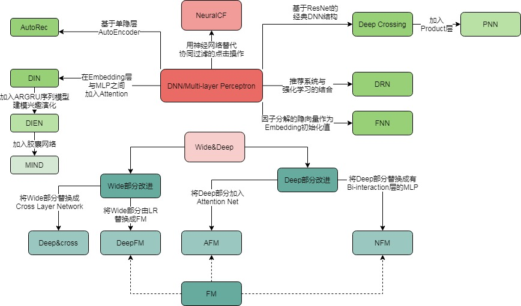

# :snail:nlp_cv_recommendation_papers:honeybee:

######  :sparkles:蜗牛会飞？:sparkles:

1. 记录NLP、CV、Recommend领域到现在发展产生的papers.
2. 根据时间线与发展流程图去介绍原理和代码实践两个方面.
3. 分析理解三个领域的发展和之间的技术联系与应用。

###### :imp: 原理介绍

 现阶段papers已基本整理完成，后续会不断添加papers阅读说明

######  :imp: 代码实践

代码实践正在进行中，有些代码正在整理。

####  :whale2: papers模拟三领域发展情况

 您可从流程图找到模型关系，并可从paper中了解原理。

######  :ram:推荐领域

######          **传统领域**  

###### :dolphin:深度学习领域

###### :dolphin:CV领域

​	正在画ing...

###### :dolphin:NLP领域

​	正在画ing...

##### :thumbsup: 参考文献​

​	《深度学习推荐系统》-王喆

**欢迎大家共同参与，共同维护！！！**

